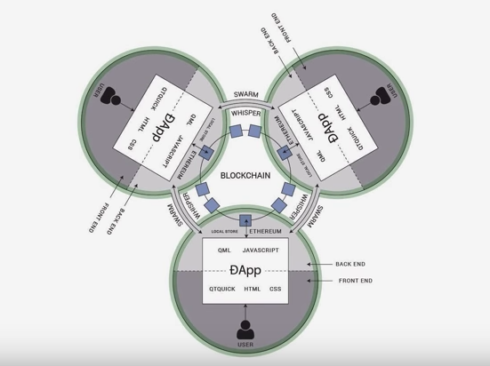

# **A decentralized apps platform**

It is widely recognised that trustless blockchain platform like Ethereum is perfectly suited to serve as the shared "back end" to a decentralized, secure internet - Web 3.0. An internet where core services like DNS and digital identity are decentralized, and where individuals can engage in economic interactions with each other.

As intended by the Ethereum developers, Ethereum and now, Ledgerium is a blank canvas and you have the freedom to build whatever you want with it. The Ledgerium protocol is meant to be generalized so that the core features can be combined in business suited ways. Ideally, dapp projects on Ledgerium will leverage the Ledgerium blockchain to build solutions that rely on decentralized consensus to provide new products and services that were not previously possible.

Ledgerium Blocchain which is built on top of Ethereum and Quorum is perhaps can be described as an ecosystem: the core protocol is supported by various pieces of infrastructure, code, and community that togetherm which enhances the Ethereum and Quorum ecosystem. 

A DApp has its backend code running on a decentralized peer-to-peer network. Contrast this with an app where the backend code is running on centralized servers.

A DApp can have frontend code and user interfaces written in any language (just like an app) that can make calls to its backend. Furthermore, its frontend can be hosted on decentralized storage such as Swarm or IPFS or centralized storage like mongoDB. 

If an app=frontend+server, since Ethereum contracts are code that runs on the global Ethereum decentralized peer-to-peer network, then:

DApp = frontend + contracts

