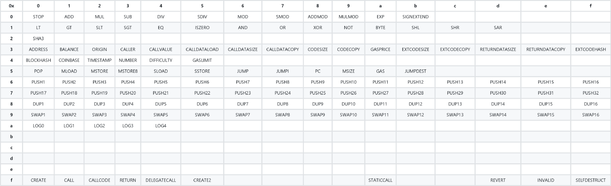
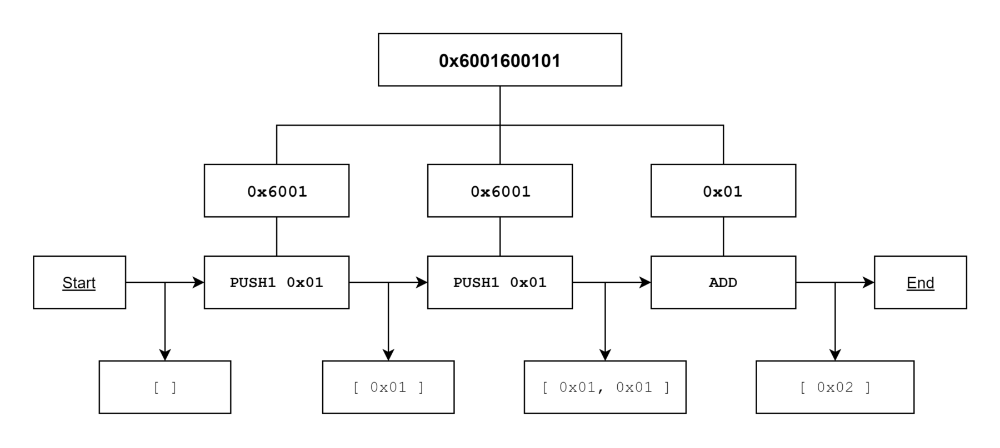
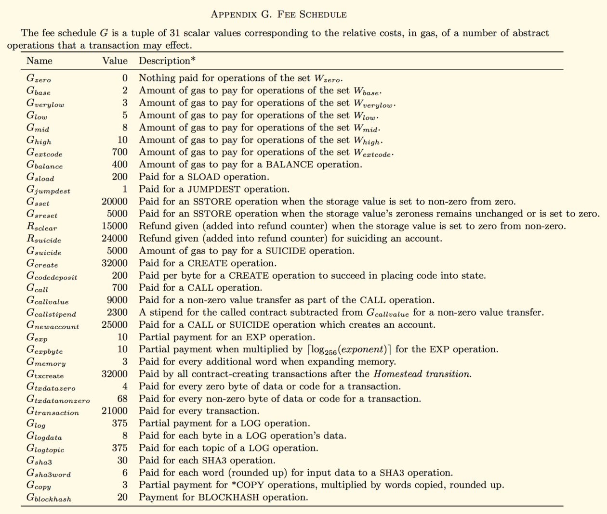
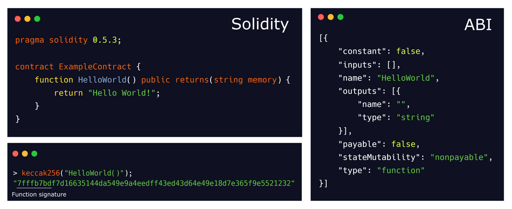

# **EVM (Ethereum Virtual Machine)**

The Ledgerium Blockhain is based on Ethereum which is a programmable blockchain. Ledgerium Blockhain allows users to create their own operations of any complexity they wish. In this way, it serves as a platform for many different types of decentralized blockchain applications, including but not limited to cryptocurrencies.

At the heart of Ledgerium Blockhain is the Ethereum Virtual Machine ("EVM"), which can execute code of arbitrary algorithmic complexity. In computer science terms, Ledgerium Blockhain is "Turing complete". Developers can create applications that run on the EVM using friendly programming languages modelled on existing languages like JavaScript and Python.

Virtual machines are essentially creating a level of abstraction between the executing code and the executing machine. This layer is needed to improve the portability of software, as well as to make sure applications are separated from each other, and separated from their host.

## **Opcodes**  

Under the hood, the EVM uses a set of instructions (called opcodes) to execute specific tasks. At the time of writing, there are 140 unique opcodes. Together, these opcodes allow the EVM to be Turing-complete. This means the EVM is able to compute (almost) anything, given enough resources. Because opcodes are 1 byte, there can only be a maximum of 256 (16²) opcodes. For simplicity's sake, we can split all opcodes into the following categories:

- **Stack-manipulating opcodes** (POP, PUSH, DUP, SWAP)  
- **Arithmetic/comparison/bitwise opcodes** (ADD, SUB, GT, LT, AND, OR)  
- **Environmental opcodes** (CALLER, CALLVALUE, NUMBER)  
- **Memory-manipulating opcodes** (MLOAD, MSTORE, MSTORE8, MSIZE)  
- **Storage-manipulating opcodes** (SLOAD, SSTORE)  
- **Program counter related opcodes** (JUMP, JUMPI, PC, JUMPDEST)  
- **Halting opcodes** (STOP, RETURN, REVERT, INVALID, SELFDESTRUCT)

Here is the list of opcodes in a table form for easy understanding. 

## **Bytecode**  

In order to efficiently store opcodes, they are encoded to bytecode. Every opcode is allocated a byte (for example; STOP is 0x00). Let’s take a look at the following bytecode: 0x6001600101

During execution, bytecode is split up into its bytes (1 byte equals 2 hexadecimal characters). Bytes in range 0x60–0x7f (PUSH1-PUSH32) are treated differently because they include push data (which needs to be attached to the opcode, instead of being treated as a separate opcode).
The first instruction is 0x60 which translates to PUSH1. Therefore, we know the push data is 1 byte long, and we add the next byte to the stack. The stack now contains 1 item, and we can move to the next instruction. Since we know 0x01 is part of a PUSH instruction, the next instruction we need to execute is another 0x60 (PUSH1) along with the same data. The stack now contains 2 identical items. The final instruction is 0x01, which translates to ADD. This instruction will take 2 items from the stack, and pushes the sum of these items to the stack. The stack now contains one item: 0x02. 

## **Contract state**  
While many popular top-level programming languages allow users to directly pass arguments to functions (function(argument1,argument2)), lower-level programming languages often use a stack to pass values to functions. The EVM uses a 256-bit register stack from which the most recent 16 items can be accessed or manipulated at once. In total, the stack can only hold 1024 items.
Because of these limitations, complicated opcodes instead use contract memory to retrieve or pass data. However, memory is not persistent. When contract execution finishes, the memory contents will not be saved. Thus, while stack can be compared to function arguments, memory can be compared to declaring variables.
In order to store data indefinitely and make it accessible for future contract executions, one can use storage. Contract storage essentially acts as a public database, from which values can be read externally without having to send a transaction to the contract (no fees!). However, writing to storage is very expensive (as much as 6000x) compared to writing to memory.

## **Costs of interacting with smart contracts**  
Since all contract executions are run by everyone running an Ethereum node, an attacker could try creating contracts including lots of computationally expensive operations to slow down the network. To prevent such attacks from happening, every opcode has its own base gas cost. Furthermore, several complicated opcodes also charge a dynamic gas cost. For instance, the opcode KECCAK256 (formerly known as SHA3) has a base cost of 30 gas, and a dynamic cost of 6 gas per word (words are 256-bit items). Computationally expensive instructions charge a higher gas fee than simple, straightforward instructions. On top of that, every transaction starts at 21000 gas.

When executing instructions which reduce state size, gas can also be refunded. Setting a storage value to zero from non-zero refunds 15000 gas, while completely removing a contract (using the SELFDESTRUCT opcode) refunds 24000 gas. Refunds only occur after contract execution has completed, thus contracts cannot pay for themselves. Additionally, a refund cannot exceed half the gas used for the current contract call.

## **Decompiling bytecode**
Several projects have created tools to attempt making bytecode more readable. For example, you can try decompiling a contract on mainnet using eveem.org or ethervm.io. Unfortunately, some parts of the original contract source, such as functions names or event names, are always lost due to optimization done by the compiler. Nonetheless, most function names can still be brute forced by comparing function signatures to large datasets containing popular function and event names (see 4byte.directory).
Contract calls usually require an **“ABI”** (Application Binary Interface), which is a piece of data documenting all functions and events, including their needed input and output. When calling a function on a contract, the function signature is determined by hashing the name of the function including its inputs (using keccak256), and truncating everything but the first** 4 bytes**.

As you can see in the image above, our function HelloWorld() resolves to the signature hash 0x7fffb7bd. If we would like to call this function, our transaction data needs to start with 0x7fffb7bd. Arguments which need to be passed to a function (none in this case) can be added in 32-byte pieces called words after the signature hash in a transaction’s input data.
If an argument contains over 32 bytes (256 bits) of data, like an array or string, the argument is split into multiple words which are added to the input data after all other arguments have been included. Moreover, the total size of all words gets included as another word, before all array words. At the location where the argument would have been included, the start position of the array words (including the size word) is added instead.  [^1]

[^1]: [EVM Article](https://medium.com/mycrypto/the-ethereum-virtual-machine-how-does-it-work-9abac2b7c9e "EVM Article")  
