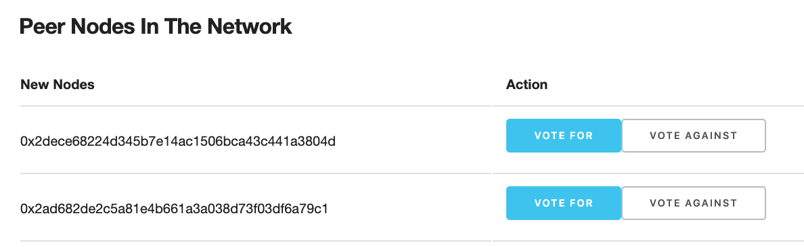

# **Governance**
Governance DApp is a way for validators to participate in on-chain governance. There is limited 21 seats for validators on Ledgerium Blockchain. This number is however subjected to change.  

## **Role of Validators**
A Validator is an independent individual who stakes their XLG and is entrusted to maintain a node on the network that validates transactions and commits new blocks to the blockchain. Validators receive a reward in XLG for provisioning blocks.

## **Responsibilites for Validators**
A Validator has both technical and social responsiblities both of which are important for the health, performance and security of the network.

### **Technical Responsibilites**
-   Ensure node is secure by practicing safe key management
-   Maintain node requisite software version
-   Monitor node to ensure its availablility and participation in consensus
-   Monitor network in general and communicate with other Validators, network entities if problems arise.

### **Social Responsibilites**
-   Participate in on-chain Governace of the network

Governance is a collection of DApps where ballots are proposed and voted on by existing Validators to manage the network. The Ballot types include:
-   Adding new Validators
-   Removing Validators, i.e. for compromising security of network,
    malicious behavior, non-participation in Governance

### **Prerequisites**
To participate in Governance, you must:
-   Be voted in as a Validator
-   Have the Ledgerium Wallet installed
-   Import your private key associated to your validator status to the wallet

### **What constitutes a passing vote**
A vote is passed if the sum is greater than to n/2, where n is the number of existing validator nodes

### **Getting started with Governance**
Every masternode is given access to Governance DApp which can be accessed at @ http://<IP Address>:3545. 

### **If you are part of validator consortium already**
You will be showing up on this list

### **If you are a masternode that has not been voted in as a Validator and are still out of validator consortium**
You will be showing up on this list

!!! note 
    If you want to join the consortium, your masternode needs to be voted in. The existing validators consortium members need to vote you in. You will have to contact them to initiate the voting process. You will have to fulfil the requirement of being validator. For more details, contact The Ledgerium Foundation and express your interest to join the consortium. They can help you out with process. 
 
### **Current voting status**
This list will show what who is voting for what decision

