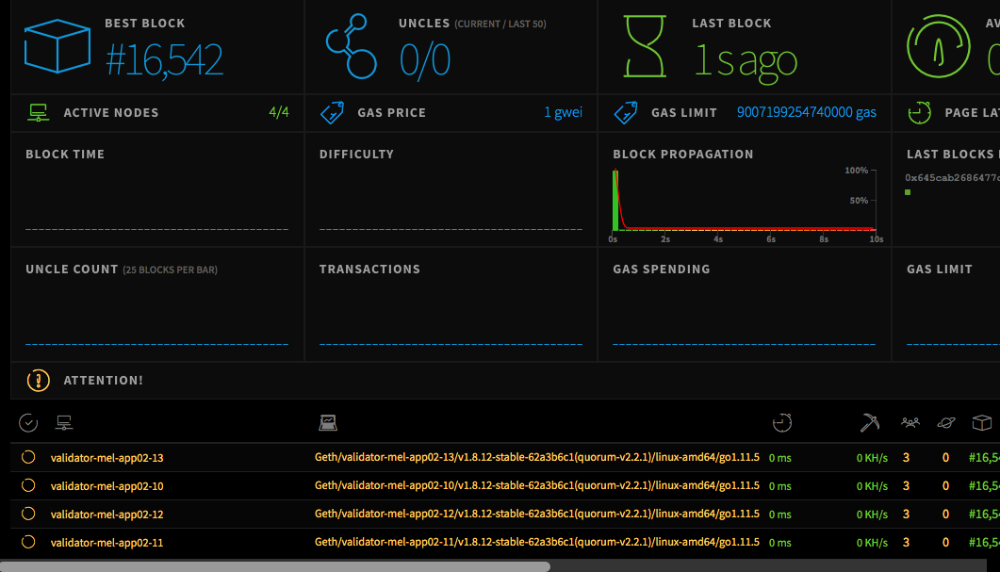
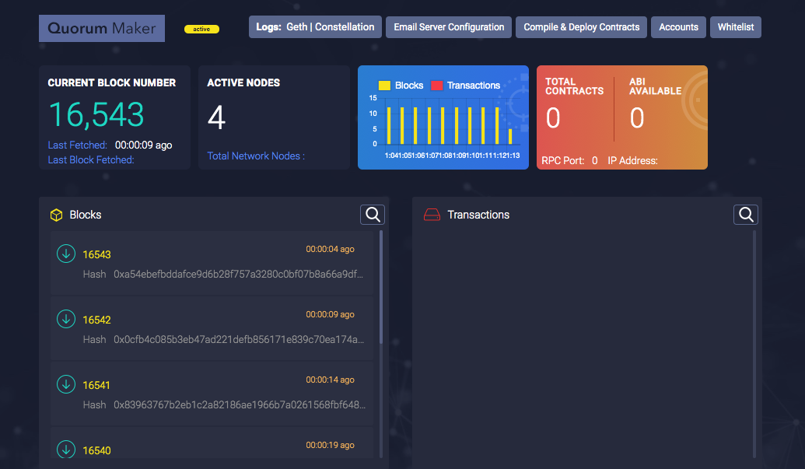
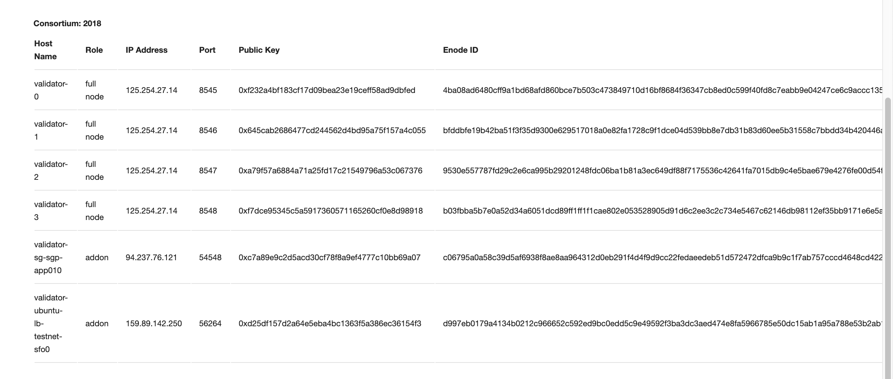

# **Setting up Master Node**

## **Getting started**
This is a full guide to set up a Ledgerium "masternode" node on a fresh linux machine The blockchain ecosystem is a combination of multiple technologies that come together. It is overwhelming to know that so much has been achieved in a short span. The tech stacks range from (not limited to this list) GoLang, NodeJs, Haskell, Metamask, Solidity and supporting Web3 technologies. Hence this will always remain as a living document for the team.

!!! info "**Minimum Hardware Specifications**"  
    **Operating System**: Ubuntu 18.04.2 LTS 64-bit OS  
    **Processor:** Intel Core i7-6820HQ @ 2.7 Ghz x 8 (cores)  
    **RAM:** 16 GB DRR3 RAM or higher  
    **Disk space:** 512GiB of General Purpose SSD with throughput limit between 128 MiB/s - 250 MiB/s  
    **Optional:** GPU cards (e.g 1 x GTX 1060 with 3GB vRAM)  
    **Bandwidth:** 1 data transfer out per month  

## **One-click Installer**
ledgerium\_setup.sh is a unix bash file that downloads and deploys one Ledgerium node (consists of Geth, Tessera, and Governance docker containers) in a single click.

Download [ledgeriumsetup](https://github.com/ledgerium/ledgeriumsetup/) code.

To download **ledgeriumsetup** go to the console and type
     
     $ mkdir ledgerium
     $ cd ledgerium
     $ git clone https://github.com/ledgerium-io/ledgeriumsetup.git
     $ cd ledgeriumsetup
     $ ./install_dependencies.sh

This script does the following
- Install prerequisite softwares (Docker and NodeJS) to run ledgerium tools
- Add $USER to docker group, to avoid using sudo before docker commands
- Creates a docker network

Once the dependencies are done installing go ahead and run the node 

     $ ./ledgerium_setup.sh

This script prompts user for mnemonics seed for the master node. The script creates a docker-compose file and brings up the cointainers

### **Mnemonics Seed**
A mnemonic phrase or mnemonic seed is a set of typically either 12 or 24 words taken from [BIP 32 English Wordlist](https://github.com/bitcoin/bips/blob/master/bip-0039/english.txt), which can be used to derive an infinite number of wallets. In the Ethereum ecosystem, mnemonic phrases are generally generated following the [BIP 32](https://github.com/bitcoin/bips/blob/master/bip-0032.mediawiki) spec. Private key and Public keys combination will be generated using the mnemonic seed. You can generate a new mnemonic seed if you install Ledgerium Metamask or most of the other Ethereum based wallets.
     
!!! warning 
     The mnemonic seed needs to be saved safely. In case the private key is lost, it can be regenerated using mnemonic seed. Once mneominc seed is lost, it can't be regenerated or retrieved. Likewise, the private key needs to be saved safely and should not shared with anyone.

## **Manual Setup**
User can setup the master node manually. Follow the steps below. Setup the ubuntu repository on the host.

### **Update the apt package index**
``` 
$ sudo apt-get update 
```

### **Install Ubuntu packages** to allow apt to use a repository over HTTPS
```
$ sudo apt-get install -y \
     apt-transport-https \ 
     ca-certificates \ 
     curl software-properties-common 
```

### ​**Install Docker CE** 
- Add Docker’s official GPG key
     ``` 
     $ curl -fsSL https://download.docker.com/linux/ubuntu/gpg | sudo apt-key add - 
     ``` 
     It should return **OK**.

     $ sudo apt-key fingerprint 0EBFCD88 pub 4096R/0EBFCD88 2017-02-22 Key fingerprint = 9DC8 5822 9FC7 DD38 854A  E2D8 8D81 803C 0EBF CD88 uid Docker Release (CE deb) <docker@docker.com sub   4096R/F273FCD8 2017-02-22 
     ```

Use the following command to set up the stable repository. You always need the stable repository, even if you want to install builds from the edge or test repositories as well. To add the edge or test repository, add the word edge or test (or both) after the word stable in the commands below.

``` 
$ sudo add-apt-repository "deb [arch=amd64] https://download.docker.com/linux/ubuntu $(lsb_release -cs) stable" 
$ sudo apt-get update 
```
     
!!! note 
     The lsb_release -cs sub-command below returns the name of your Ubuntu distribution, such as xenial. Sometimes, in a distribution like Linux Mint, you might need to change $(lsb_release -cs) to your parent Ubuntu distribution. For example, if you are using Linux Mint Rafaela, you could use trusty. 

### **Install Docker CE**
- Update the apt package index
     ``` 
     $ sudo apt-get update -y
     ```

- Install the latest version of Docker CE, or go to the next step to install a specific version.
     ``` 
     $ sudo apt-get install -y docker-ce 
     ```

- Verify that Docker CE is installed correctly by running the hello-world image. 
     ```
     $ sudo docker run hello-world 
     ```

### **Install Docker Compose**
- Run this command to download the latest version of Docker Compose:
     ``` 
     $ sudo curl -L "https://github.com/docker/compose/releases/download/1.23.2/docker-compose-$(uname -s)-$(uname -m)" -o /usr/local/bin/docker-compose 
     ```

     **Note** : Install Docker Engine version 1.7.1 or greater.

- Apply executable permissions to the binary: 
     ```
     $ chmod +x /usr/local/bin/docker-compose
     ```

- Optionally, install command completion for the bash and zsh shell.  

- Test the installation by docker-compose
     ```
     $ docker-compose --version 
       docker-compose version 1.23.2, build 1110ad01
     ```  
- To create the docker group and add your user:  
     - Create the docker group. 
          ```
          $ sudo groupadd docker 
          ```  
     - Add your user to the docker group.
          ```
          $ sudo usermod -aG docker $USER
          ```

- Log out and log back in so that your group membership is re-evaluated. If testing on a virtual machine, it may be necessary to restart the virtual machine for changes to take effect.  On a desktop Linux environment such as X Windows, log out of your session completely and then log back in.  

- Verify that you can run docker commands without sudo. 
     ```
     $ docker run hello-world
     ```  
     
     Install NodeJS  [Reference](https://linuxize.com/post/how-to-install-node-js-on-ubuntu-18.04/)
     
     ```
     $ sudo apt-get update && 
       sudo apt-get -y upgrade && 
       curl -sL <https://deb.nodesource.com/setup_8.x -o nodesource\_setup.sh && 
       sudo bash nodesource\_setup.sh && 
       sudo apt-get install $ nodejs && 
       rm nodesource\_setup.sh
     ```  

### **Confirming Ledgerium Network is up and running correctly**
We can see if the application ran correctly by going to ethstats on http://testnet.ledgerium.net:3000

 This will show us:
     -   Block data and minting status
     -   Validator/Node data
     -   Transactions statistics

 

 We also have the Quorum dashboard accessible by http://testnet.ledgerium.net:9999

 

 And the Governance user intreface accessible by http://testnet.ledgerium.net:3545

 

### **Manually shutting down a node** 
```
$ cd \~/ledgerium/ledgeriumtools/output
$ docker-compose down
```

Confirm your node is up the same way you would when you first build and
run your first node

### **Manually starting up a node**
```
$ cd \~/ledgerium/ledgeriumtools/output
$ docker-compose up
```

## **Deconstructing the docker-compose.yml file**
A genereated docker compose file will consist of 3 image containers per node. These are as follows:
- **Ledgerium Core**  
     - **Purpose:** This is the actual validator node  
     - **Ports required:**  
          - 30303 Network listening port
          - 8545 HTTP-RPC server listening port
          - 9000 WS-RPC server listening port

# **Ledgerium Blockchain master node**
Each masternode of Ledgerium Blockchain is configured with following commands in its setup file `docker-compose.yml`.

!!! note "Geth Commands"
      **geth**  
      **--datadir** '/eth'  
      **--networkid** 2019  
      **--identity** "validator-0"  
      **--rpc** 
      **--rpcaddr** '0.0.0.0'  
      **--rpcport** 8545  
      **--rpccorsdomain** '\*'  
      **--rpcapi** 'db,eth,net,web3,istanbul,personal,admin,debug,txpool'  
      **--rpcvhosts**=localhost  
      **--ws**  
      **--wsorigins** '*'  
      **--wsapi** 'db,eth,net,web3,personal,admin,debug,txpool'  
      **--wsaddr** '0.0.0.0'  
      **--wsport** 9000  
      **--mine**  
      **--minerthreads** 1  
      **--syncmode** 'full'  
      **--targetgaslimit** 9007199254740000  
      **--port** "30303"  
      **--debug**  
      **--metrics**  
      **--txpool.nolocals**  
      **--txpool.accountslots** 128  
      **--txpool.globalslots** 32768  
      **--txpool.accountqueue** 512  
      **--txpool.globalqueue** 8192  
      **--nodekeyhex** "83a5803e698a3642d5309f119643f6a729c7c51fac00fdffac31983cb5275bb5"  
      **--etherbase** "f232a4bf183cf17d09bea23e19ceff58ad9dbfed"  
      **--ethstats** "validator-0:bb98a0b6442334d0cdf8a31b267892c1@testnet.ledgerium.net:3000"  
      **--verbosity** 6  
      **--emitcheckpoints**

- **Tessera**  
     - **Purpose**: Quorum Transaction Manager - implementation of peer-to-peer encrypted message exchange for transaction privacy  
     - **Ports required:** 
         - 10000  
         - 10100 

- **Governance**  
     - **Purpose:** Goveranance App contains smart contracts to manage admin and individual validators to come on platform  
     - **Ports required:** 
         - 3545

### **Official Docker Containers**
The official docker containers can be found under https://hub.docker.com/u/ledgeriumumengineering/
